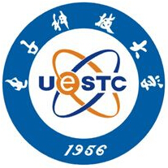
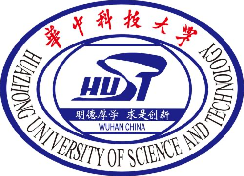
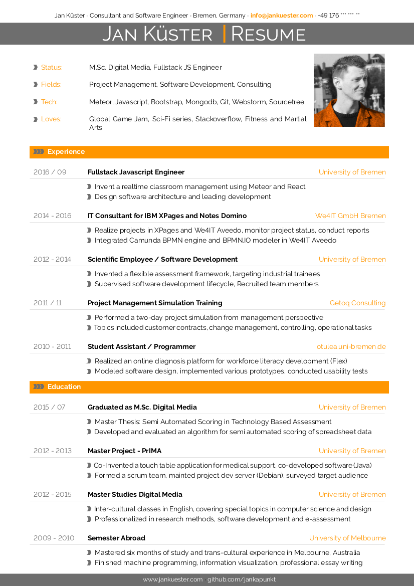
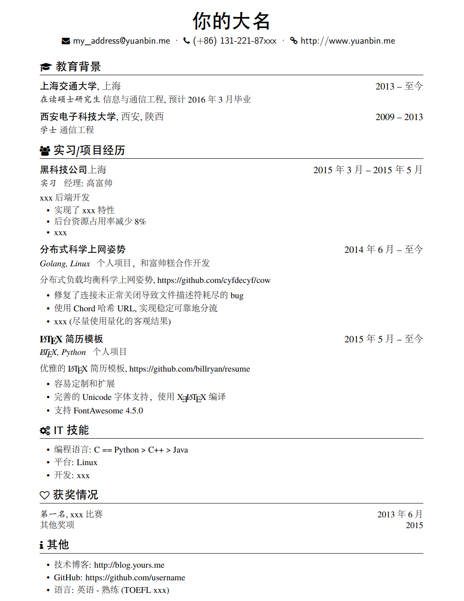
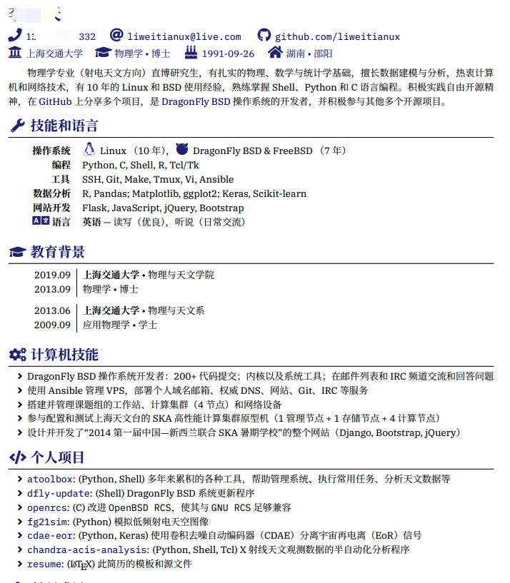
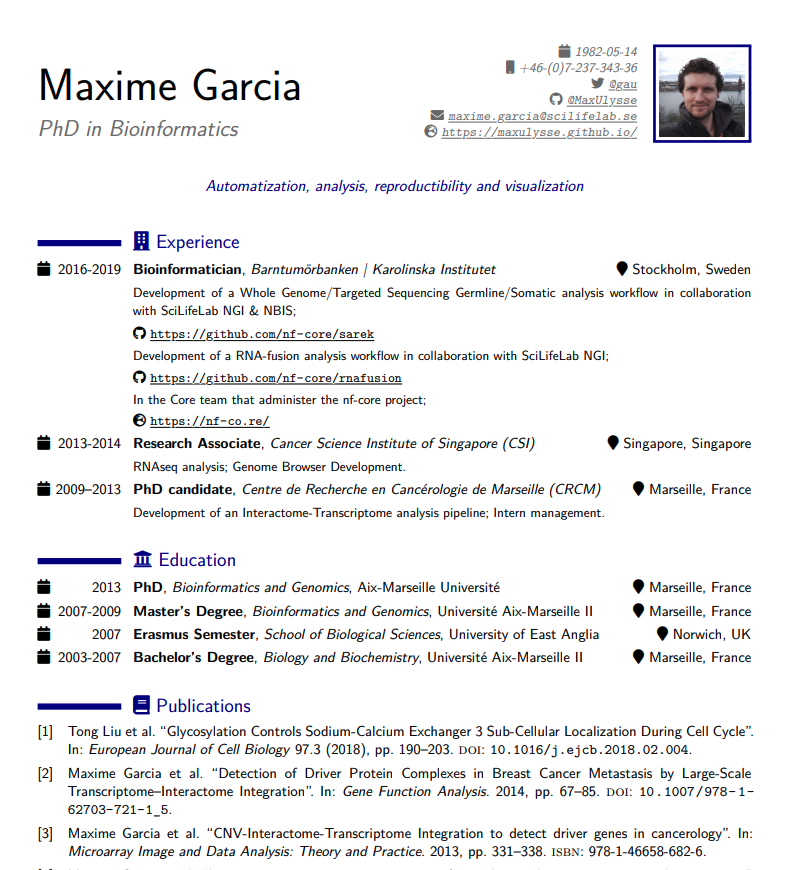
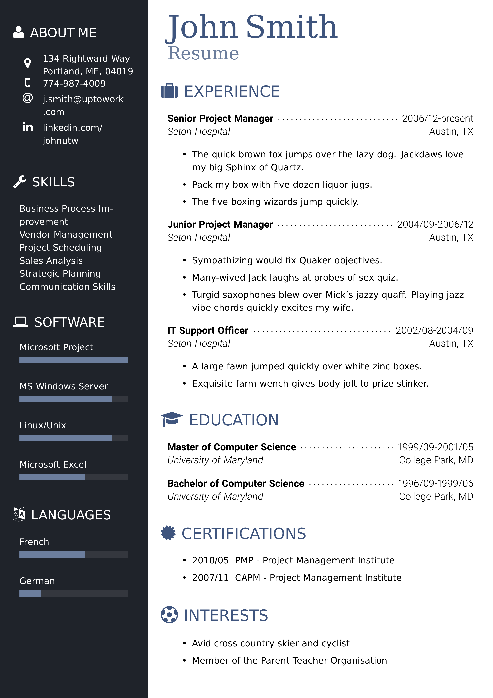
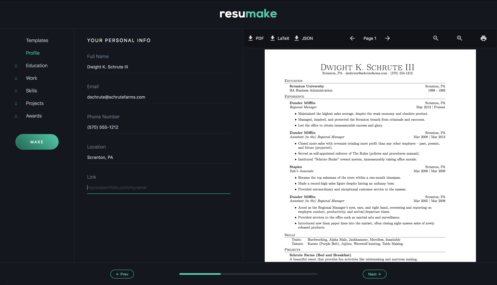
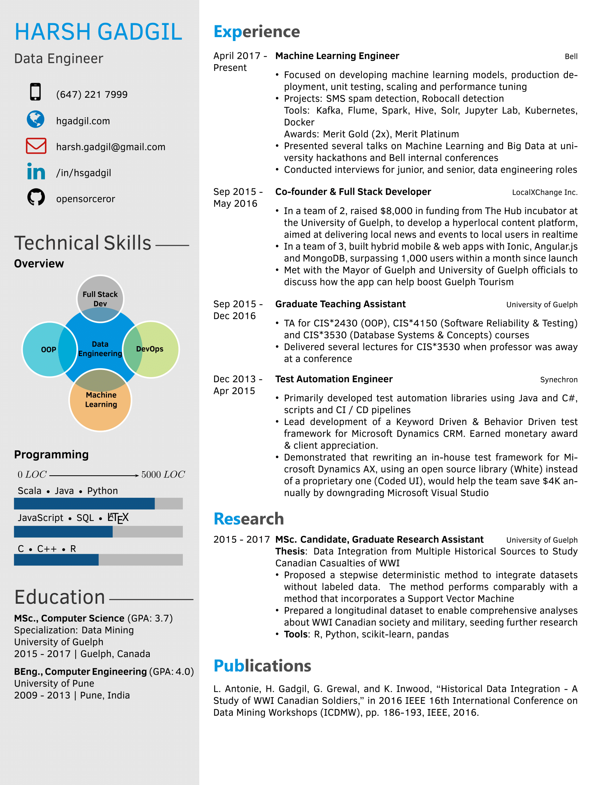
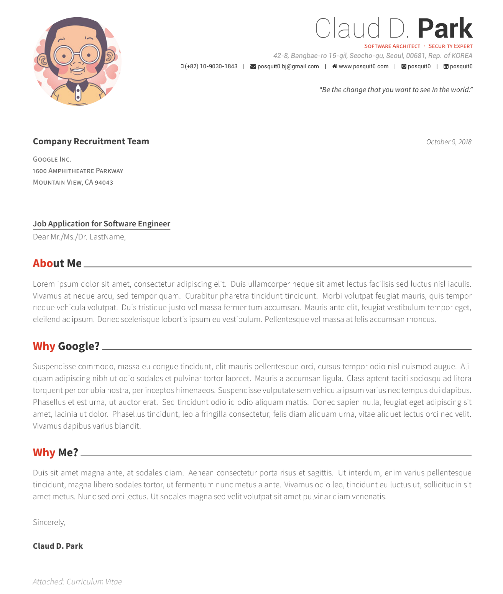

# latex-templates

 

ʕ̢̣̣̣̣̩̩̩̩•̫͡•ʕ̢̣̣̣̣̩̩̩̩•̫͡•Ɂ̡̣̣̣̣̩̩̩̩•̫͡•Ɂ̡̣̣̣̣̩̩̩̩

Latex 模板合集，旨在帮助大家输出更加漂亮、干净、专业的文稿 ʕ̢̣̣̣̣̩̩̩̩˄·͈༝·͈˄Ɂ̡̣̣̣̣̩̩̩̩◞ ̑̑ 喵  

---
## 全国各高校模板（持续整理更新）

*排名不分先后*

|    | 学校 | 模板链接   |  备注  |
| :---- | :----| :---- | :---- |
|  | [天津大学（Tianjin University, TJU）](http://www.tju.edu.cn/) | [TJUThesisLatexTemplate](https://github.com/xnth97/TJUThesisLatexTemplate) |   |
|  | [中国科学院大学（University of Chinese Academy of Sciences, UCAS）](https://www.ucas.ac.cn/) | [ucasthesis](https://github.com/mohuangrui/ucasthesis) / [ucasproposal](https://github.com/mohuangrui/ucasproposal) |   |
|  | [电子科技大学（University of Electronic Science and Technology of China, UESTC）](https://www.uestc.edu.cn/) | [ThesisUESTC](https://github.com/x-magus/ThesisUESTC) / [UESTCthesis](https://github.com/shifujun/UESTCthesis) |   |
|  | [上海交通大学（Shanghai Jiao Tong University, SJTU）](https://www.sjtu.edu.cn/) | [SJTUThesis](https://github.com/sjtug/SJTUThesis) |   |
|  | [哈尔滨工业大学（Harbin Institute of Technology, HIT） ](http://www.hit.edu.cn/) | [hithesis](https://github.com/dustincys/hithesis) |   |
|  | [北京邮电大学（Beijing University of Posts and Telecommunications, BUPT）](https://www.bupt.edu.cn/) | [BUPTBachelorThesis](https://github.com/sheng-qiang/BUPTBachelorThesis) |   |
|  | [广州大学（Guangzhou University, GU）](http://www.gzhu.edu.cn/) | [GZHU-Report-Latex-Version](https://github.com/swq123459/GZHU-Report-Latex-Version) |   |
|  | [华中科技大学（Huazhong University of Science and Technology, HUST）](https://www.hust.edu.cn/) | [HUSTPaperTemp](https://github.com/skinaze/HUSTPaperTemp) |   |
|  | [武汉大学（Wuhan University, WHU）](https://www.whu.edu.cn/) | [whu-thesis](https://github.com/mtobeiyf/whu-thesis) |   |
|  | [南京大学（Nanjing University, NJU）](https://www.nju.edu.cn/) | [njuthesis-nju-thesis-template](https://github.com/njuHan/njuthesis-nju-thesis-template) |   |
|  | [同济大学（Tongji University）](https://www.tongji.edu.cn/) | [TongjiThesis](https://github.com/marquistj13/TongjiThesis) |   |
|  | [华南理工大学（South China University of Technology, SCUT）](https://www.scut.edu.cn/) | [scutthesis](https://github.com/alwintsui/scutthesis) |   |
|  | [重庆大学（Chongqing University, CQU）](https://www.scut.edu.cn/) | [CQUThesis](https://github.com/nanmu42/CQUThesis) |   |
|  | [华南师范大学（South China Normal University, SCNU）](https://www.scnu.edu.cn/) | [scnuthesis](https://github.com/scnu/scnuthesis) |   |
|  | [西安交通大学（Xi'an Jiaotong University, XJTU）](http://www.xjtu.edu.cn/) | [xjtuthesis](https://github.com/Aetf/xjtuthesis) |   |
|  | [浙江大学（Zhejiang University, ZJU）](http://www.zju.edu.cn/) | [zju-csse-undergraduate-design-latex-template](https://github.com/zhanghai/zju-csse-undergraduate-design-latex-template) |   |
|  | [长安大学（Chang'an University, CHD）](https://www.chd.edu.cn/) | [chdthesis](https://github.com/xiaoleeza/chdthesis) |   |

---
## 简历模板（持续整理更新）

| 预览   | 模板链接   |  备注  |
| :---- | :----| :---- |
| | [awesome-resume-for-chinese](https://github.com/dyweb/awesome-resume-for-chinese) | 适合中文的简历模板 |
|  | [LaTex CV and Resume Collection](https://github.com/jankapunkt/latexcv) | A collection of simple and easy to use, yet powerful LaTeX templates for CVs and resumes |
|    | [resume](https://github.com/billryan/resume/tree/zh_CN)   |  一个简洁优雅的 XeLaTeX 简历模板  |
|    | [resume](https://github.com/liweitianux/resume)   |  Font Awesome 5 LaTeX style  |
|    | [myCV](https://github.com/MaxUlysse/myCV)   |  My own CV made with compile-latex  |
|    | [classycv](https://github.com/classysoftware/classycv)   |  For classy job applications, including a themes and extension library.  |
|    | [resumake.io](https://resumake.io/)   |  一个自动生成精美 LaTeX 简历的网站  |
|    | [Data-Engineer-Resume-LaTeX](https://github.com/opensorceror/Data-Engineer-Resume-LaTeX)   |  为求职数据科学家/工程师的人量身定制的 Latex 简历模版  |
|    | [Awesome-CV](https://github.com/posquit0/Awesome-CV)   |  受 [Fancy CV](https://www.sharelatex.com/templates/cv-or-resume/fancy-cv) 启发的简历或求职信的 LaTeX 模板 |
|    | [Overleaf Templates — Résumé / CV](https://www.overleaf.com/latex/templates/tagged/cv/page/1)   | Overleaf 上的 Latex 简历模板，可以直接在 Overleaf 编辑并生成自己的简历 |
| **creodocs**   | [CVs and Resumes](http://www.latextemplates.com/cat/curricula-vitae)   | 新西兰一家小型企业，基于 LaTeX 创建用于商业、学术和个人用途的高质量文档 |

---
## 有趣的 Latex 玩法推荐

| 说明   | 网址链接   |  备注  |
| :---- | :----| :---- |
| 开源的数学白板工具 | [Muboard](https://github.com/susam/muboard) |
| 各国国旗 | [Flags](https://www.overleaf.com/gallery/tagged/insignia) |
| 用Tikz 画神舟12号 | [https://mp.weixin.qq.com/s/14VzXQ3Q35Ut8H92qhdZnQ](https://mp.weixin.qq.com/s/14VzXQ3Q35Ut8H92qhdZnQ) |

---
## CTAN（The Comprehensive TEX Archive Network）
* [https://ctan.org/mirrors/](https://ctan.org/mirrors/)
* [https://ctan.org/mirrors/mirmon#cn](https://ctan.org/mirrors/mirmon#cn)

---
## 相关网站
> * [Latex 工作室](https://www.latexstudio.net/)
> * [Learn LaTeX](https://www.learnlatex.org/en/)
> * [LaTeX Templates](http://www.latextemplates.com/)